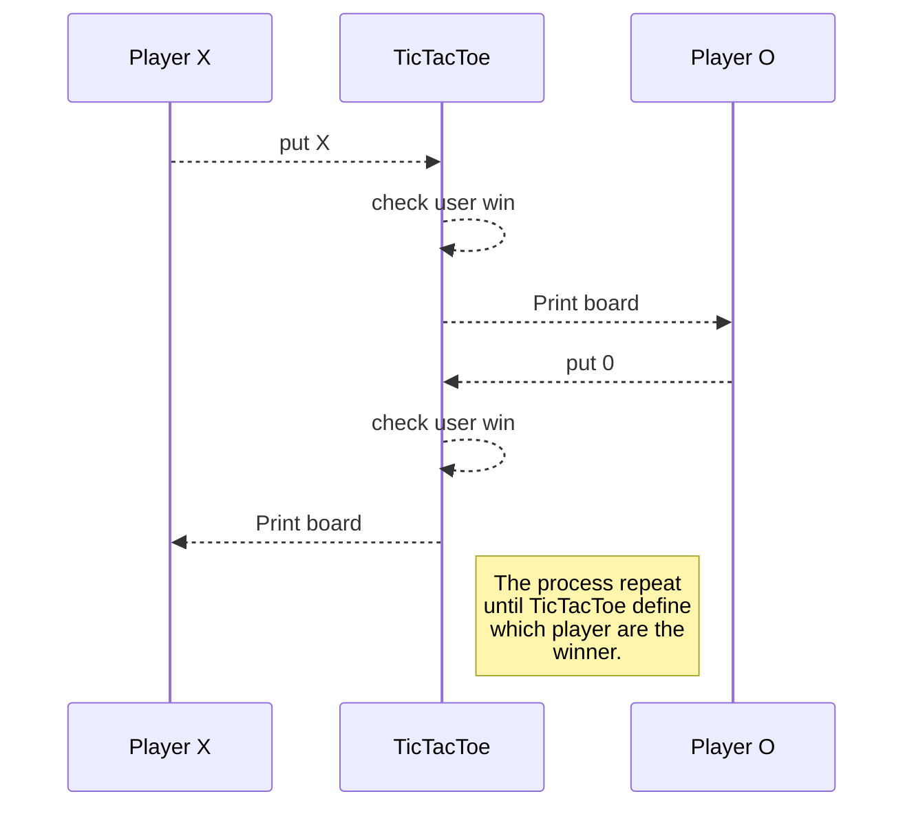

# Tic Tac Toe {Gato}
## Rules
<ul>
  <li>Two players represented with X and O</li>
  <li>First time the game is played, X starts</li>
  <li>Each player alternate turns to put a mark in the board on any available slot</li>
  <li>The game ends when either one of the players matches three marks in a horizontal, vertical or diagonal row or there are no more moves available</li>
  <li>Once the game finishes, players are asked if they want to play again. If they do, the player who lost the previous match starts. In case of a draw, the player who did the second-to-last movement starts</li>
</ul>

## Explain

This is a educative game you need to have hard knowledge in math special at "Cartesian's plane" to choose coordinates to get place in the board.
The Tic Tac Toe board is same to  Cartesian's plane because its similary to use cells to identify all position that have.
With a simple change in the coordinates format, example normaly we write (x,y) to express the coordinates in one plane with "x" and "y" pivot, but in this game we'll expres (x,y) with xy no math signs, ex. (1,2) ~> 12 that means x = 1 and y = 2 expressing that ordinary number.
This game is funny and helpful all students that needs to reforce them habilities in "Cartesian's plane" of math



by 
Antonio Moreno

### About game logic

Download this repository. Run the next command in your console in the main folder.

```
gem build tictactoe.gemspec
```

After run this command

```
gem install ./TicTacToe-0.0.1.gem
```

Gem TicTacToe-0.0.1.gem require the class `Tic` to use you need to build and run main.rb
```
ruby main.rb
```


