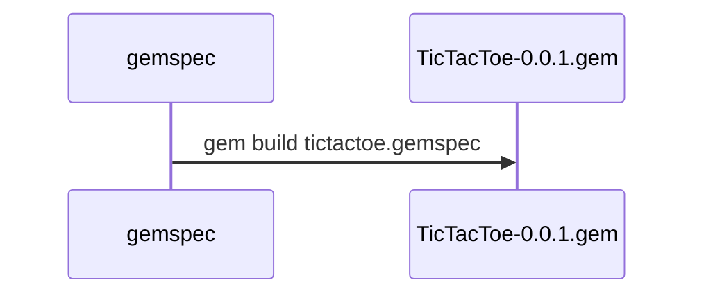

# Tic Tac Toe {Gato}
## Rules
<ul>
  <li>Two players represented with X and O</li>
  <li>First time the game is played, X starts</li>
  <li>Each player alternate turns to put a mark in the board on any available slot</li>
  <li>The game ends when either one of the players matches three marks in a horizontal, vertical or diagonal row or there are no more moves available</li>
  <li>Once the game finishes, players are asked if they want to play again. If they do, the player who lost the previous match starts. In case of a draw, the player who did the second-to-last movement starts</li>
</ul>

## Explain

